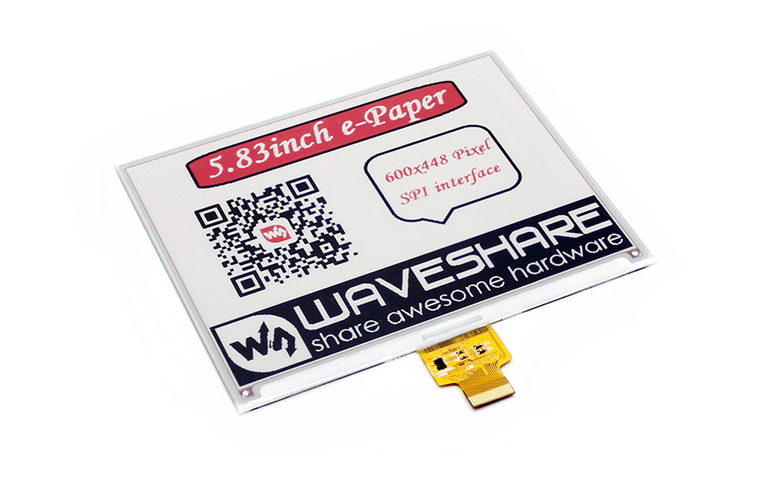
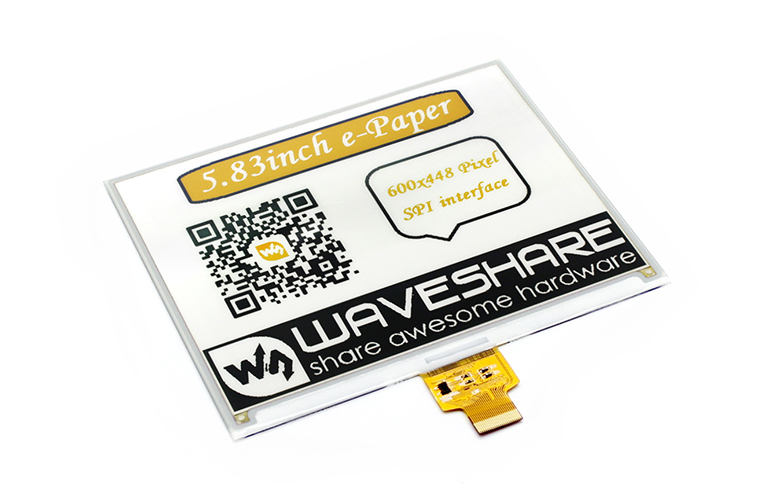

# 5.83inch B&C e-Paper

## 5.83inch B e-Paper

## 中文:  
上传的为RaspberryPi和Arduino程序:  
* RaspberryPi:  
    > BCM2835  
    > WiringPi  
    > Python2  
    > python3  
* Arduino:  
    > Arduino UNO  
    
更多资料请在官网上搜索:   
http://www.waveshare.net/shop/5.83inch-e-Paper-B.htm

## English:  
Uploaded as RaspberryPi and Arduino programs:  
* RaspberryPi:  
    > BCM2835  
    > WiringPi  
    > Python2  
    > python3  
* Arduino:  
    > Arduino UNO  
    
For more information, please search on the official website:  
https://www.waveshare.com/5.83inch-e-paper-b.htm

## 5.83inch C e-Paper

## 中文:  
上传的为RaspberryPi和Arduino程序:  
* RaspberryPi:  
    > BCM2835  
    > WiringPi  
    > Python2  
    > python3  
* Arduino:  
    > Arduino UNO  
    
更多资料请在官网上搜索:   
http://www.waveshare.net/shop/5.83inch-e-Paper-C.htm

## English:  
Uploaded as RaspberryPi and Arduino programs:  
* RaspberryPi:  
    > BCM2835  
    > WiringPi  
    > Python2  
    > python3  
* Arduino:  
    > Arduino UNO  
    
For more information, please search on the official website:  
https://www.waveshare.com/5.83inch-e-paper-c.htm
